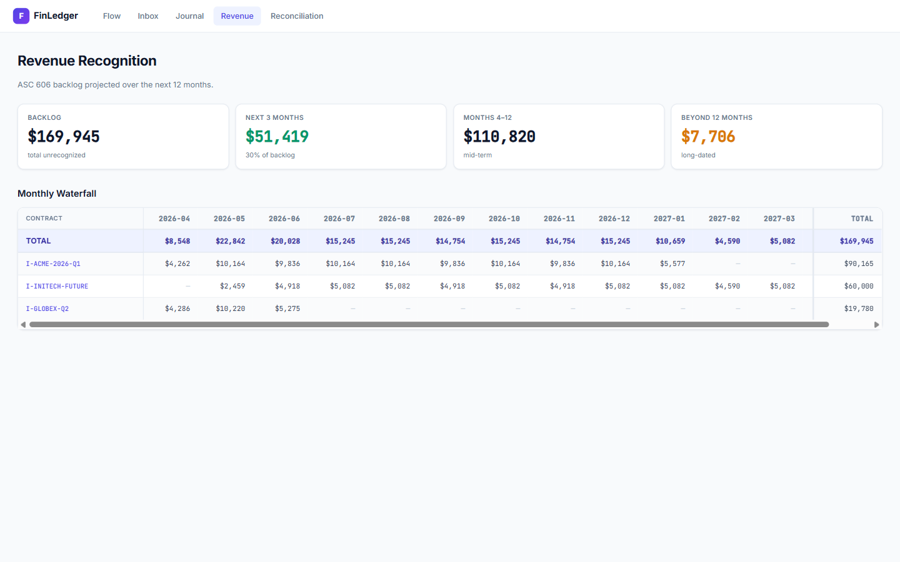

# FinLedger

[](https://github.com/ypratap11/finledger/actions/workflows/ci.yml)
[](LICENSE)

An open-source SaaS finance pipeline. Stripe and Zuora webhooks enter through a Node/TS edge, land in a hash-chained source-event inbox, are posted by a Python engine into a double-entry ledger (enforced by Postgres triggers), and are reconciled against the source — all viewable on an HTMX dashboard. An ASC 606 revenue-recognition engine drains deferred revenue over time. A pluggable GL exporter writes CSV journal files today; SAP/Oracle/NetSuite connectors slot into the same seam later.



See `docs/superpowers/specs/2026-04-14-finledger-design.md` for the full design, and `docs/superpowers/plans/` for the implementation plans (M1, M2a-1).

## One-command quickstart

```bash
git clone https://github.com/ypratap11/finledger.git
cd finledger
docker compose -f docker-compose.full.yml up --build
```

Then open **http://localhost:8003/** — postgres, migrations, demo seed data, the Python UI, and the Node ingest-edge all come up together.

## What M1 demonstrates

- **At-least-once-safe webhook ingestion** — Stripe signature verification, idempotent inbox insert by `(source, external_id)`, hash-chained for tamper detection.
- **Double-entry ledger** — `debits = credits` enforced by PostgreSQL CHECK trigger, posted entries immutable by trigger.
- **Posting engine** — maps source events to balanced journal entries; crash-safe (unprocessed rows retried); unknown event types parked with error.
- **Stripe↔Ledger reconciliation** — matches by `external_ref = stripe charge id`; reports matched/unmatched/mismatched with persistent break records.
- **Pluggable GL export** — `JournalExporter` protocol + `CsvJournalExporter` aggregates period journals to CSV with sha256 audit trail. SAP/Oracle connectors are M2 drop-ins.
- **Property-based tests** — `trial balance == 0` invariant holds under randomized event sequences; inbox replay is deterministic.

## What M2a-1 adds (ASC 606 Step 5)

- **Contracts + performance obligations.** Auto-created from Zuora `invoice.posted` events that carry `metadata.service_period_start` / `service_period_end`, with an admin fallback API (`POST /revrec/contracts`, `POST /revrec/contracts/{id}/obligations`) for one-off cases.
- **Recognition engine.** Ratable (daily accrual) + point-in-time patterns. On-demand trigger (`POST /revrec/run`) or daily scheduled job (`python -m finledger.workers.revrec_scheduler`). One aggregated journal entry per run (DR Deferred Revenue / CR Revenue); per-obligation audit trail in `revrec.recognition_events`.
- **Waterfall view.** 12-month projection at `/revrec` with Backlog / Next-3 / Beyond pillars, contract detail pages with recognized/deferred progress bars, and a chronological recognition log.
- **Editorial-finance UI.** Fraunces display type, bone/cream paper surface, hairline rules, JetBrains Mono tabular numerics — distinct from the M1 utilitarian dashboard because revrec is the long-form analytical surface.
- **Property invariants.** Full recognition over random obligation sets keeps trial balance at zero AND recognizes exactly the contracted total.

See `docs/superpowers/specs/2026-04-16-m2a-1-revrec-design.md` for the full design.

M2a-2 (SSP allocation + contract modifications) and M2a-3 (variable consideration + constraint) are planned follow-ups. Consumption-based recognition is M2a-1.5.

## Run locally

    docker compose up -d postgres
    cd core && pip install -e '.[dev]' && alembic upgrade head
    .venv/Scripts/uvicorn finledger.ui.app:app --reload --port 8000 &

    cd ../ingest-edge && npm install
    STRIPE_WEBHOOK_SECRET=whsec_test npm run dev &

Visit `http://localhost:8000/` for the admin dashboard.

## Tests

    cd core
    pytest tests/unit
    pytest tests/integration
    pytest tests/property

## Known limitations in M1

- JSON canonicalization between Node and Python uses a recursive sorted-keys implementation on both sides, verified against Python's `json.dumps(sort_keys=True, separators=(",",":"))`. Cross-language hash-chain parity holds for nested payloads; there is no third-party canonical-JSON library in either stack for M1.
- M1 assumes `currency = USD` at the ledger invariant level. Multi-currency + FX comes in a later milestone.
- GL export is CSV-only. SAP FBDI / IDoc, Oracle FBDI, NetSuite SuiteTalk are M2.
- No rev rec, no Zuora↔Ledger recon, no approval workflow. M2/M3.

## What's next

- **M2** — Zuora sandbox integration, contracts + performance obligations, ASC 606 revenue schedules (ratable + consumption), rev waterfall view, Zuora↔Ledger recon, first real ERP connector (likely Oracle FBDI or NetSuite).
- **M3** — Auth + SOD approval workflow, second ERP connector, Ledger↔GL recon, hash-chain verify scheduled job.

## Layout

    ingest-edge/     Node/TS Fastify webhook edge (Stripe + Zuora)
    core/            Python FastAPI + posting engine + recon + revrec + UI + GL export
    docs/            specs + plans + task RFCs + screenshots
    fixtures/        sample webhook payloads for tests

## Contributing

See [CONTRIBUTING.md](CONTRIBUTING.md) for quickstart, test instructions, code style, and how to file issues / submit PRs. Good-first-issue candidates: additional source adapters (Chargebee, Paddle, Maxio), additional GL exporters (NetSuite, SAP, Oracle), accessibility audit.

## License

Apache 2.0. See [LICENSE](LICENSE).
